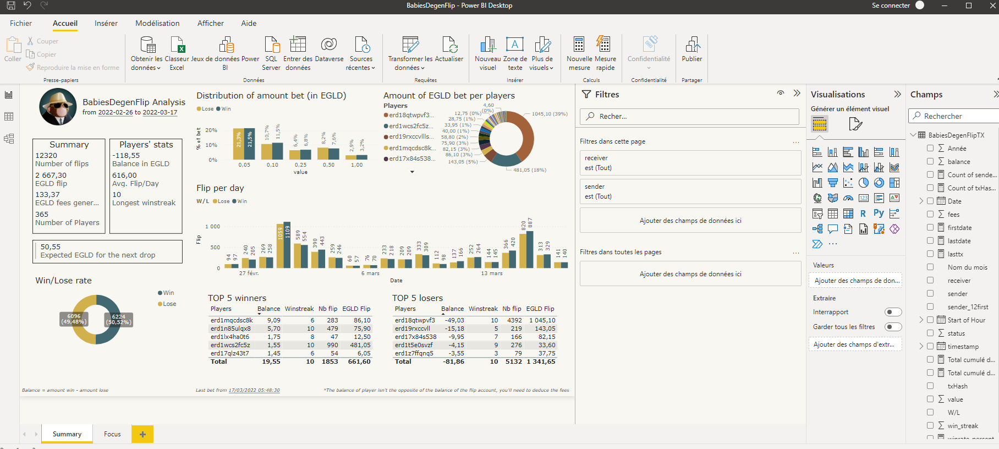

# BabiesDegenFlipTx

BabiesDegenFlipTx is a Python class used to pull data from Elrond Blockchain for the flip game of the NFT project BabiesDegenApe : 
https://www.babiesdegenapeflip.com/

DISCLAIMER : I'm not inciting to play ! Gambling is a risk and a responsability. Be careful. 

# Table of Contents

1. [Python setup](#my-first-title)
2. [PowerBi Dashboard](#my-second-title)


## Python setup

```bash
$git clone https://github.com/ZnyBD/BabiesDegenFlipTX.git
```

## Usage

```python
from request_tx import BabiesDegenFlipTx

#select the period
date_from = "2022-03-16 20:00:00"
date_to = "2022-03-17 07:00:00"

BDF = BabiesDegenFlipTx(date_to = date_to, date_from = date_from) #Starting session to scrap data from BabiesDegenFlip

BDF.get_all_tx() #get every transaction info in the date range
print("\nWin/Lose status :")

#getting sc results for every tx, then deciding if win or lose according to it
BDF.get_wallet_WoL(thread = 150) 

#get the maximum winstreak per player
BDF.get_winstreak()

#export data in a .json database
BDF.export_data(name = "BabiesDegenFlipTX.json")

#update data into an existing json database
BDF.update_data(name = "BabiesDegenFlipTX.json") 
```

## PowerBi Dashboard

A python dashboard has been made. You can update the data, change the graphics however you want. Focus on a player in particulary, etc. 

